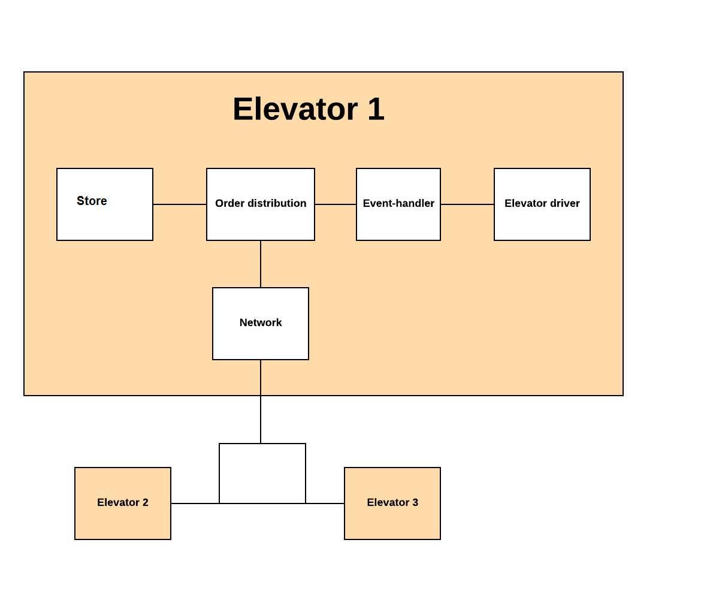

# Updated design

Bruker designet som vi ble enige om til design review. .

* Lokal heis får en HallCall. Dette oppdages av driver og eventhandler som sender den til order distributor.
* Order Distributor(OD) kjører en cost funksjon som ligger i store og får den best egnede heisen. OD sender den til store som oppdaterer lokal store.
* OD sender så orderen ut på nettverket. 
* OD er også ansvarlug for å lytte på nettverket og fortelle store til å oppdatere store. 
* Event handler lytter etter endringer i store og kjører heis basert på det som er der. 
* 
